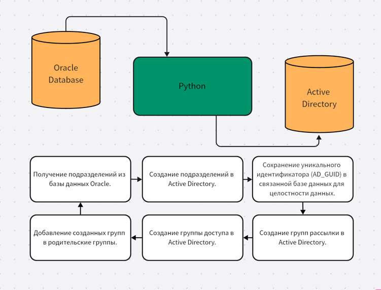

Модуль синхронизации данных для ИАС “Электронный университет” КФУ.

Целью данной работы является разработка модуля на Python для синхронизации данных между базой данных Oracle Database и Active Directory.

## Инструменты

* Python
* Oracle Database
* SQLAlchemy
* Active Directory
* python-ldap